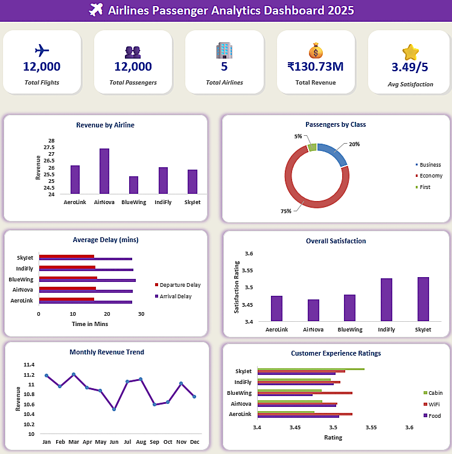

# ✈️ Airlines Passenger Analytics Dashboard

## 📌 Project Overview

This project analyzes airline passenger data using Microsoft Excel. The objective is to identify travel patterns, customer satisfaction, flight delays, revenue trends, and operational performance through an interactive dashboard.

## 🎯 Business Objective

- Analyze airline performance.
- Monitor passenger satisfaction.
- Evaluate flight delays.
- Understand customer travel preferences.
- Track total revenue.

## 📂 Dataset Information

- Dataset: Airline Passenger Dataset
- Total Rows: 12,000
- Total Columns: 32
- Airlines: 5

## 🛠️ Tool Used

- Microsoft Excel

## 📊 Skills Demonstrated

- Data Cleaning
- Exploratory Data Analysis (EDA)
- Pivot Tables
- Pivot Charts
- Dashboard Design
- KPI Cards
- Data Visualization

## 📈 Dashboard KPIs

- Total Flights
- Total Passengers
- Total Airlines
- Total Revenue
- Average Ticket Price
- Average Flight Duration
- Average Overall Satisfaction

## 📊 Dashboard Preview

## 📄 Project Documentation

📥 **Download Project Documentation**

[Documentations.pdf](Documentations.pdf)

## 📑 Business Insights

📥 **Download Business Insights**

[BusinessInsights.pdf](BusinessInsights.pdf)

## 📁 Files Included

- Dashboard.png
- Documentations.pdf
- BusinessInsights.pdf

## 💡 Key Insights

- Total of 12,000 passenger records were analyzed.
- Five airlines were compared based on revenue and customer satisfaction.
- Economy Class had the highest passenger share.
- Flight delays varied across airlines.
- Monthly revenue showed noticeable fluctuations.
- Customer experience ratings differed across airlines.
-

## 👨‍💻 Created By

**Mohd Sahil**

Aspiring Data Analyst
