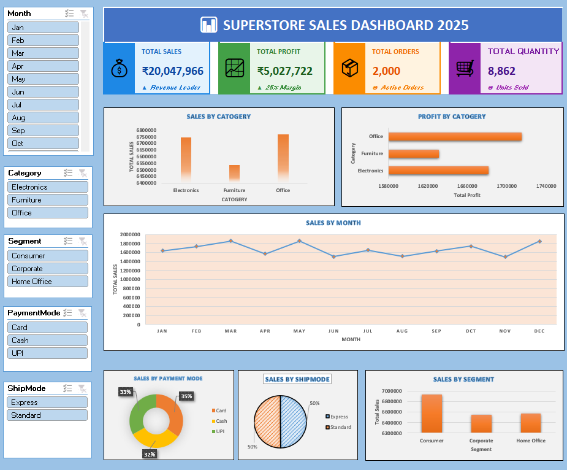

# 📊 HR Analytics Dashboard – Microsoft Excel

An interactive **HR Analytics Dashboard** built in **Microsoft Excel** to analyze employee attrition, workforce trends, and key HR metrics. This project transforms raw HR data into meaningful insights using Excel's powerful data analysis and visualization features.

## 🎯 Project Overview

The dashboard enables HR professionals to monitor employee attrition, identify workforce patterns, and make data-driven decisions for improving employee retention.

## 🛠️ Tools & Technologies

- Microsoft Excel
- Power Query
- Pivot Tables
- Pivot Charts
- Slicers
- Excel Formulas (IF, COUNTIF, SUMIFS, AVERAGEIFS, etc.)

## 💡 Skills Demonstrated

- Data Cleaning & Transformation
- Data Analysis
- KPI Development
- Interactive Dashboard Design
- Data Visualization
- Business Insight Generation

## 📈 Key Performance Indicators (KPIs)

| KPI | Value |
|------|------:|
| Total Employees | 1,470 |
| Active Employees | 1,233 |
| Attrition Count | 237 |
| Attrition Rate | 16.1% |
| Average Monthly Income | ₹6,503 |

## 📊 Dashboard Insights

### Department-wise Attrition

| Department | Employees | Attrition | Rate |
|------------|----------:|----------:|-----:|
| Sales | 446 | 92 | 20.6% |
| Human Resources | 63 | 12 | 19.0% |
| Research & Development | 961 | 133 | 13.8% |

### Age Group Analysis

| Age Group | Attrition Rate |
|-----------|---------------:|
| 18–25 | 35.8% |
| 26–35 | 19.1% |
| 36–45 | 9.2% |
| 46–60 | 12.5% |

## 🔍 Key Findings

- 🚨 Employees working overtime have significantly higher attrition.
- 💰 Low-income employees show the highest turnover.
- 💼 Sales Representatives experience the highest attrition among job roles.
- 💍 Single employees leave more frequently than married employees.
- ✈️ Frequent business travelers have higher attrition rates.

## 💡 Recommendations

- Reduce excessive overtime.
- Improve retention strategies for employees aged 18–25.
- Review Sales Representative compensation and career growth.
- Reassess salary structures for lower-income employees.
- Optimize business travel policies to improve work-life balance.

## 🖼️ Dashboard Preview

- 

## 📁 Files Included

- 📄 [HR Analytics Report](Documentation.pdf)
- 📈 [HR Analytics Report](Insight20%Analysis.pdf)

## 📊 Dataset Information

- **Records:** 1,470 Employees
- **Attributes:** 37 Columns
- **Key Fields:** Age, Department, Job Role, Gender, Monthly Income, Attrition, Overtime, Business Travel, Marital Status, Education, Performance Rating, and more.

## 🖼️ Dashboard Features

- Interactive KPI Cards
- 7 Dynamic Charts
- Department-wise Analysis
- Job Role Analysis
- Age Group Analysis
- Overtime Impact
- Income Analysis
- Marital Status Breakdown
- Interactive Slicers for Data Filtering

## 🏆 Project Outcome

This dashboard provides an easy-to-use HR reporting solution that helps organizations:

- Monitor employee attrition trends
- Identify high-risk employee segments
- Improve workforce planning
- Support strategic HR decision-making
- Generate actionable business insights

## 👤 Author

**Mohd Sahil**

Aspiring Data Analyst | Microsoft Excel | Power Query | Data Visualization | Dashboard Development
