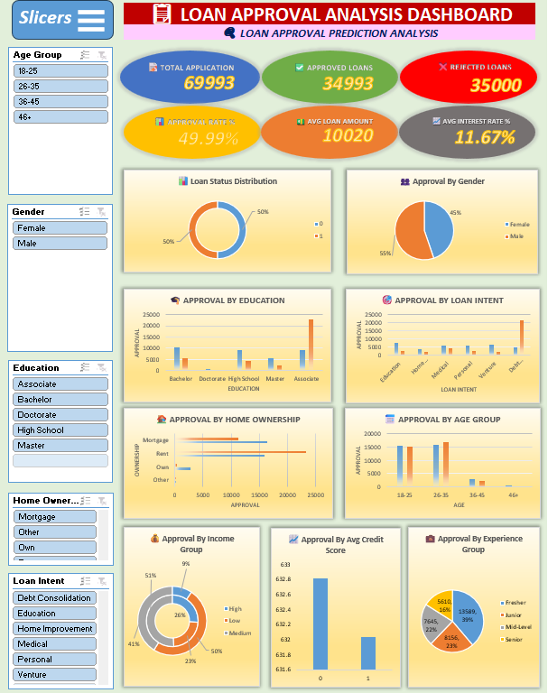

💳 Bank Loan Analytics Dashboard (Microsoft Excel)

📌 Project Overview

The Bank Loan Analytics Dashboard is an end-to-end Excel Data Analytics project designed to analyze loan applications, customer profiles, and loan approval trends. The dashboard helps identify key factors influencing loan approvals, customer risk, and lending performance through interactive visualizations and KPI reporting.

🎯 Business Objective

The objective of this project is to analyze loan data and answer key business questions such as:

- What is the overall loan approval rate?
- Which customer groups receive the most loan approvals?
- Which loan purposes are most common?
- How do income and credit score affect loan approval?
- Which regions generate the highest number of loan applications?

🛠 Tools & Skills Used

- Microsoft Excel
- Pivot Tables
- Pivot Charts
- Slicers
- Conditional Formatting
- SUMIFS
- COUNTIFS
- IF
- XLOOKUP / VLOOKUP
- Interactive Dashboard Design

📂 Dataset Information

The dataset includes:

- Loan ID
- Customer ID
- Age
- Gender
- Marital Status
- Employment Status
- Annual Income
- Loan Amount
- Loan Purpose
- Interest Rate
- Loan Term
- Credit Score
- Loan Status
- Region
- Application Date

📊 Key Performance Indicators (KPIs)

- Total Loan Applications
- Total Approved Loans
- Approval Rate
- Total Loan Amount
- Average Loan Amount
- Average Interest Rate
- Average Credit Score

📈 Dashboard Visualizations

- Loan Approval Status
- Monthly Loan Applications
- Loan Amount by Purpose
- Approval Rate by Gender
- Approval Rate by Employment Status
- Income Distribution
- Credit Score Analysis
- Region-wise Loan Applications
- Interest Rate Analysis
- Loan Term Analysis

🔍 Key Business Insights

- Identified the factors affecting loan approval.
- Compared approval rates across customer segments.
- Analyzed loan demand by purpose and region.
- Evaluated the relationship between income, credit score, and loan approval.
- Highlighted trends in loan applications over time.

📷 Dashboard Preview

📂 Files Included

## 📁 Files Included

- 📄 [Bank Loan Analytics Dashboard](Documentation.pdf)
- 📈 [Bank Loan Analytics Dashboard](Insight20%Analysis.pdf)

🚀 Skills Demonstrated

- Data Cleaning
- Data Analysis
- Data Visualization
- Dashboard Design
- KPI Reporting
- Business Analytics
- Excel Analytics

👤 Author

Mohd Sahil

Aspiring Data Analyst
